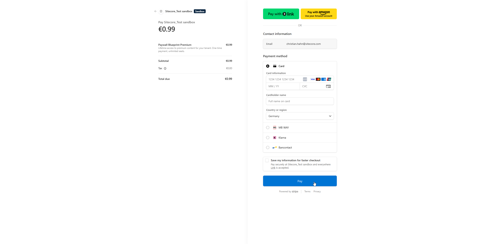

#  Paywall Blueprint

**Author:** [Christian Hahn](https://www.linkedin.com/in/christian-hahn-solo/) — _Technical Product Manager DevEx & SDKs @ Sitecore_

The first publicly available worked example of monetizing a Sitecore Marketplace App.

This repo shows, step by step, how to put a freemium paywall inside a Sitecore Cloud Portal
Marketplace App — a `<PaywallGate>` React component that evaluates tenant entitlement, four
ready-to-ship UX state components, a swappable `EntitlementStore` adapter backed by Supabase,
and a `PaymentProvider` interface stub ready for your first Stripe integration. Fork it, swap
the content and the adapters, ship a paywalled Marketplace app in hours.

**Who it is for:** Teams building or planning a paid Marketplace App on the Sitecore Cloud
Portal who want a real, documented reference — not a toy demo.

---

## Screenshots

Captured from the running app inside the Sitecore Cloud Portal `xmc:fullscreen` iframe (dark theme). PRD-002 replaced the four single-state PRD-000 screens with an 11-card bento dashboard at `/full-page` (5 free real-data cards + 6 fake-data premium cards per ADR-0018). The `<NoSubscriptionState>` / `<AllowedState>` / `<SeatsFullState>` / `<UserUnassignedState>` components stay in the codebase as design reference for adopter forks that want per-seat or assignment flows.

### Locked — free tier visible, premium blurred


5 free cards (Welcome, Sites, Plan, User profile, Tenant info) render real tenant data from `host.user`, `application.context`, `xmc.sites.listSites`, and the Supabase `tenants` row. The 6 premium cards mount as placeholder silhouettes under `filter: blur(12px)` per ADR-0018. The Subscribe banner sits as a **sibling** of the blurred region (POC v2 § 7 canonical structure) so it stays readable above the rasterized children — making it a child of the region would have inherited the parent's blur filter and rendered the banner unreadable.

### Unlocked — full premium tier revealed after €0.99 lifetime payment


All 11 cards visible after Stripe Checkout success → iframe reload → entitlement evaluates to `allowed`. Premium cards stagger-in over 600 ms with 100 ms per-card delays following DOM = visual reading order (P1 → P6): a Recharts area chart (lazy-loaded ~300 kb chunk), four animated progress bars by template type, a 5-row Sitecore-flavored recent-edits list, four CMS health KPI tiles with `requestAnimationFrame` counters, three hardcoded content-insights bullets, and an SVG progress ring + dashed forecast sparkline. Premium content is intentionally fake per ADR-0018 — adopters who fork the blueprint are expected to swap in their own real-data hooks and add server-side entitlement enforcement (see § "Production hardening for adopters" in `site/README.md`).

### Stripe Checkout — €0.99 lifetime



Stripe-hosted checkout opens in a new tab after the user clicks Subscribe in the bento's Unlock banner. Line item: *Paywall Blueprint Premium — Lifetime access to premium content for your tenant. One-time payment, unlimited seats.* On successful payment Stripe redirects to `/paywall-return`; the iframe's `useEntitlement` hook detects the entitlement flip via `visibilitychange` + 3 s polling and triggers `window.location.reload()` → the bento re-renders unlocked. The `processed_events` idempotency cache + `${id}:${PARAMS_VERSION}` keying (PRD-001) prevent duplicate Stripe sessions when the user retries.

---

## What is inside

The repo is a single Next.js (App Router + TypeScript) application structured as a Sitecore
Marketplace custom app on the `xmc:fullscreen` extension point. There are four logical parts:

### 1. `<PaywallGate>` component

`site/src/lib/paywall/PaywallGate.tsx`

A React client component that orchestrates entitlement evaluation in six steps (per FR-1):

1. **Env-flag check** — when `NEXT_PUBLIC_PAYWALL_ENABLED=false`, renders children verbatim
   and shows the demo-mode banner. No entitlement call is made.
2. **Context-readiness guard** — waits for the Marketplace SDK's `useAppContext()` to resolve;
   shows a skeleton in the meantime.
3. **Context validation** — throws (caught by the error boundary) if `marketplaceAppTenantId`
   is missing.
4. **Dev override** — compile-time-guarded short-circuit for local development
   (`NEXT_PUBLIC_PAYWALL_DEV_OVERRIDE_USER_ID`). Dead-code-eliminated from production builds.
5. **Entitlement fetch** — calls `EntitlementStore.getEntitlement(tenantId, userId)` and
   shows a skeleton while the promise is pending. Re-throws on rejection.
6. **State render** — switches on `EntitlementResult.status` and renders the matching state
   component.

### 2. `EntitlementStore` adapter — Supabase v1

`site/src/lib/paywall/stores/SupabaseStore.ts`

Implements the `EntitlementStore` interface (production runtime) and the `EntitlementSeed`
interface (dev / CLI seeding) against a two-table Supabase Postgres schema (`tenants` +
`processed_events`). See [Two abstraction boundaries](#two-abstraction-boundaries) for how
to swap it.

PRD-000's evaluator is **tenant-only** (ADR-0011): `getEntitlement` consults the `tenants`
table only. The `userId` parameter is accepted for interface stability but is not consulted
in this PRD. Per-user seat enforcement lands in PRD-002.

### 3. `PaymentProvider` interface — Stripe v1 placeholder

`site/src/lib/paywall/types.ts`

A type-only placeholder interface in PRD-000. The four methods (`generateCheckoutUrl`,
`generatePortalUrl`, `verifyWebhookSignature`, `parseWebhookPayload`) define the contract
that PRD-001 implements against Stripe Billing + Entitlements API + Customer Portal.

No concrete implementation ships in PRD-000 — see [Provider swap-point](#provider-swap-point-post-prd-001).

### 4. Reference Marketplace app

`site/app/page.tsx`

A single-page freemium layout on the SitecoreAI Full Screen extension point (`xmc:fullscreen`):

- **Free section** — always rendered; a placeholder "Inventory at a glance" card with a
  mock report button.
- **Separator.**
- **Gated section** — wrapped in `<ErrorBoundary><GatedSection></ErrorBoundary>`. Inside,
  `<PaywallGate>` resolves to one of four state components. The free section above the
  boundary keeps rendering even when the gated subtree throws.

---

## Two abstraction boundaries

This is the core design pattern. Two interfaces in `site/src/lib/paywall/types.ts` are the
swap-points:

### `EntitlementStore` (production runtime, required for adopters)

```typescript
export interface EntitlementStore {
  getEntitlement(tenantId: string, userId: string): Promise<EntitlementResult>;
}
```

`SupabaseStore` is the v1 implementation. To swap: implement `EntitlementStore` against your
own backend (REST API, Redis, another Postgres, a headless CMS — anything). Pass an instance
to `<PaywallGate store={yourStore}>`. The gate does not care what sits behind the interface.

**ADR-0002** (binding): `EntitlementStore` (production) and `EntitlementSeed` (dev CLI) are
intentionally split. Do not add seed or write methods to `EntitlementStore`.

### `PaymentProvider` (payment adapter, type-level in PRD-000)

```typescript
export interface PaymentProvider {
  generateCheckoutUrl(args: { tenantId: string; userEmail: string; priceId?: string; returnUrl?: string }): Promise<string>;
  generatePortalUrl(args: { tenantId: string; returnUrl: string }): Promise<string>;
  verifyWebhookSignature(rawBody: string, signature: string): Promise<boolean>;
  parseWebhookPayload(rawBody: string): Promise<{ providerEventId: string; tenantId: string; kind: 'subscription_created' | 'subscription_updated' | 'subscription_cancelled' | 'payment_failed' | 'payment_succeeded'; payload: unknown }>;
}
```

PRD-001 implements this against Stripe Billing + Entitlements API + Customer Portal. Until
then it is a type-only placeholder — nothing in PRD-000 instantiates it.

**ADR-0003** (binding): PRD-000 ships the contract; PRD-001 ships the first concrete implementation.

---

## Tenant-only evaluator (ADR-0011) — what ships vs what is deferred

PRD-000's `SupabaseStore.getEntitlement` only looks at the `tenants` table. It returns:

- `allowed` — tenant row exists and `status === 'active'`.
- `tenant_no_subscription` — no row, or `status !== 'active'`.

**The two seat-related UX states (`SeatsFullState`, `UserUnassignedState`) ship in PRD-000
as design-reference components.** They are fully built and tested, but the PRD-000 evaluator
never routes to them. You can render them directly via `npm run seed:state -- seats-full` or
`npm run seed:state -- unassigned` (they bypass the evaluator and render the component
directly via a `?previewState=` query param).

Per-user seat enforcement — the evaluator branch that routes to those states — lands in
PRD-002, which adds the `seats` table and the seat-count logic.

---

## Quickstart

### Prerequisites

- Node.js 20+
- A free Supabase account at [supabase.com](https://supabase.com)
- Access to Sitecore Cloud Portal with App Studio permissions

### Steps

**1. Fork or clone this repo.**

```bash
git clone https://github.com/Chris1415/Sitecore.Plugin.PaywallBlueprint.git
cd Sitecore.Plugin.PaywallBlueprint
```

**2. Install dependencies.**

```bash
cd site && npm install
```

**3. Create a free Supabase project.**

Go to [supabase.com](https://supabase.com) → New project. From Project Settings → API,
capture:

- Project URL (looks like `https://<id>.supabase.co`)
- `anon` / public key (labeled "publishable" in newer dashboards)
- `service_role` / secret key (labeled "secret" in newer dashboards — keep this server-side only)

**4. Run the database schema.**

In Supabase → SQL Editor, open a new query. Paste the contents of
`site/supabase/schema.sql` and click Run. This creates:

- `tenants` table — one row per paying tenant.
- `processed_events` table — empty in PRD-000; provisioned for PRD-001 Stripe webhook
  idempotency.

Verify: `SELECT COUNT(*) FROM tenants;` returns 0 (empty, as expected).

**5. Configure your environment.**

```bash
cp site/.env.example site/.env.local
```

Open `site/.env.local` and fill in:

```bash
NEXT_PUBLIC_SUPABASE_URL=https://<your-project>.supabase.co
NEXT_PUBLIC_SUPABASE_PUBLISHABLE_KEY=<anon/publishable key>
SUPABASE_SECRET_KEY=<service-role/secret key>

# Your tenant ID from the Marketplace SDK (see step 6)
OPERATOR_TENANT_ID=<marketplaceAppTenantId from the Cloud Portal iframe URL>
# Your user sub from the host identity token
OPERATOR_USER_ID=<host.user.sub from the application.context probe>
```

**6. Register a custom app in Sitecore Cloud Portal → App Studio.**

- App name: `Paywall Blueprint (Test)` (or any name)
- App URL: `http://localhost:3000`
- Extension point: `xmc:fullscreen` (SitecoreAI Full Screen)
- Route URL: `/`
- Authorization type: Portal-brokered
- App type: Custom

Install the app on your test tenant. The `marketplaceAppTenantId` appears in the iframe URL
query string once the app is installed — capture it for `OPERATOR_TENANT_ID` above.

**7. Start the dev server.**

```bash
npm run dev
```

Opens [http://localhost:3000](http://localhost:3000). The app also renders inside the Cloud
Portal iframe once installed.

**8. Seed the `allowed` state and verify.**

```bash
npm run seed:state -- allowed --tenant <your-marketplaceAppTenantId>
```

Refresh the iframe in Cloud Portal. You should see the post-gate welcome: "Welcome, [your
first name]. Your tenant [your tenant name] has full access."

**9. Try the denial state.**

```bash
npm run seed:state -- no-sub --tenant <your-marketplaceAppTenantId>
```

Refresh. You should see "Start your subscription" with a "View plans" CTA.

**10. Try the design-reference states (bypass evaluator).**

```bash
# Does not seed anything — renders component directly via ?previewState= query param
npm run seed:state -- seats-full
npm run seed:state -- unassigned
```

These open a URL in your browser with `?previewState=seats-full` or `?previewState=unassigned`.
The evaluator is not called. These states are visual references for PRD-002.

---

## Stripe Setup

PRD-001 wires a real Stripe Checkout flow into the blueprint. Follow these 6 steps to
connect your own Stripe account.

**1. Create or pick a Stripe account.**

Sign up for free at [https://stripe.com](https://stripe.com). For a paid Marketplace
app you will eventually need to enable Stripe Connect — that is out of scope for this
blueprint (see Roadmap).

**2. Switch to test mode.**

Toggle "Test mode" in the upper-right corner of the Stripe Dashboard. Test mode is
free, isolated from live money, and is what the blueprint targets by default.

**3. Create the Product + Price.**

Two options:

- **Reuse the blueprint defaults** (only useful if you are running the operator's
  Stripe account — not portable): Product `prod_UWKcVQmJH2MiSa`, Price
  `price_1TXHyIAHnDmxitZjwxHhKe8y` (one-time €0.99 EUR).
- **Create your own:** Dashboard → Catalog → Products → "Add product" → name "Paywall
  Blueprint Premium" (or your own name) → Price section → choose "One-time" → €0.99
  EUR. Save. Copy the Price ID (starts with `price_`).

**4. Copy your API keys.**

Dashboard → Developers → API keys.

- "Publishable key" (starts with `pk_test_`) → `NEXT_PUBLIC_STRIPE_PUBLISHABLE_KEY`
  in `site/.env.local`
- "Secret key" (reveal once; treat as a password) → `STRIPE_SECRET_KEY` in
  `site/.env.local`

**5. Local webhook listener (development).**

Install the Stripe CLI per [https://docs.stripe.com/stripe-cli](https://docs.stripe.com/stripe-cli),
then:

```bash
stripe login
stripe listen --forward-to https://localhost:3000/api/webhooks/stripe --skip-verify
```

> **Important:** the dev server runs `next dev --experimental-https` (mkcert). The
> `--forward-to` URL must use `https://` and the `--skip-verify` flag is required
> because mkcert is self-signed. Stripe CLI defaults to plain `http://` if no scheme
> is given, which silently fails — the trigger output reports success but webhooks
> never arrive.

The CLI prints a `whsec_*` signing secret on startup. Copy that value into
`STRIPE_WEBHOOK_SIGNING_SECRET` in `site/.env.local` and restart the dev server.
**Each `stripe listen` session mints a fresh signing secret.**

**6. Production webhook endpoint.**

Stripe Dashboard → Developers → Webhooks → Add endpoint.

- URL: `https://<your-production-domain>/api/webhooks/stripe`
- Select all 6 event types: `checkout.session.completed`,
  `checkout.session.async_payment_succeeded`,
  `checkout.session.async_payment_failed`, `customer.subscription.updated`,
  `customer.subscription.deleted`, `invoice.payment_failed`.

Copy the production signing secret to your hosting platform's environment variables
(Vercel → Project Settings → Environment Variables). **Do NOT put it in
`.env.local`** — that file is local-only and gitignored.

> **CSP heads-up:** the `next.config.mjs` ships with `frame-ancestors` including
> `https://app.sitecorecloud.io` (the canonical Cloud Portal origin). If you add a
> custom Vercel domain or serve from another Cloud Portal environment, add those
> origins to the `frame-ancestors` list in `next.config.mjs`.

### Stripe environment variables

| Variable | Purpose | Server-only? | Required? |
|---|---|---|---|
| `STRIPE_SECRET_KEY` | Stripe API auth (server-side) | YES | YES |
| `NEXT_PUBLIC_STRIPE_PUBLISHABLE_KEY` | Stripe.js init (client-readable) | NO | YES |
| `STRIPE_PRICE_ID` | Price ID for the €0.99 lifetime price | YES (server convention) | YES |
| `STRIPE_WEBHOOK_SIGNING_SECRET` | Verify webhook signatures | YES | YES |

### Test card numbers

Use these in Stripe Checkout test mode (any future MM/YY, any 3-digit CVC, any
postal code — test mode is lenient):

- `4242 4242 4242 4242` — generic success
- `4000 0000 0000 9995` — insufficient funds (card declined)
- `4000 0025 0000 3155` — 3D Secure authentication required

### Optional: Stripe Tax

The blueprint ships with `automatic_tax: { enabled: true }` in `StripeProvider.ts`
(search `automatic_tax` — it is on line ~95). Stripe Tax is an opt-in Dashboard
feature:

1. Dashboard → Settings → Tax → Activate.
2. The Checkout Session params already include
   `customer_update: { address: 'auto', name: 'auto' }`. This captures the
   customer's billing address during Checkout and saves it to the Customer record.
   **Stripe requires this when `automatic_tax: true` is set against an existing
   Customer with no address — without it you will get
   `customer_tax_location_invalid`.**

To disable Stripe Tax: change `automatic_tax: { enabled: true }` to
`{ enabled: false }` in `site/src/lib/paywall/providers/StripeProvider.ts` and
remove the `customer_update` line. Then bump `CHECKOUT_PARAMS_VERSION` (the constant
directly above the class declaration) — see "Idempotency key versioning" in the Known
limitations section.

---

## Known limitations of v1 / Adopter responsibilities

**1. `/api/entitlement` is UNAUTHENTICATED in v1.**

The server reads tenant entitlement directly via the Supabase service-role key.
There is no auth check on the GET endpoint (NFR-7). Adopters using this for
production-sensitive tenant lists MUST add per-route authentication — for example,
verify that `host.user.sub` from the Marketplace SDK context matches the requested
`tenantId` before returning data. PRD-002 hardens this as part of the per-user seat
enforcement work.

**2. Webhook event ordering is not reconciled.**

Out-of-order events are not buffered or sequenced. Each event upserts or updates the
`tenants` row independently. In practice this is rare — Stripe delivers events in
approximate creation order — but adopters with strict reconciliation needs should add
an `event.created` timestamp check and sequence buffering on top of the existing
`processed_events` idempotency table.

**3. `STRIPE_PRICE_ID` is not validated at boot.**

A typo in the Price ID causes the first checkout attempt to fail at runtime with a
translated `resource_missing` error (visible in the dialog). Adopters who want
fail-fast startup can add a probe:

```typescript
// In a server startup hook (e.g. instrumentation.ts):
await stripe.prices.retrieve(process.env.STRIPE_PRICE_ID!);
```

**4. `charge.refunded` is NOT handled — returns 200 silently.**

The webhook handler fall-through acknowledges the event but takes no action on
refunds. Adopters who want refund-driven downgrade can add a case branch in
`site/app/api/webhooks/stripe/route.ts`:

```typescript
if (event.type === 'charge.refunded') {
  const charge = event.data.object as Stripe.Charge;
  await supabase
    .from('tenants')
    .update({ status: 'cancelled', updated_at: new Date().toISOString() })
    .eq('stripe_customer_id', charge.customer);
  return Response.json({ ok: true }, { status: 200 });
}
```

**5. Dialog Cancel stays enabled mid-flight (by design — FR-8).**

Closing the dialog stops the in-iframe polling loop but does NOT close the Stripe
Checkout tab that was opened in a new browser tab. If the user completes payment
in that still-open tab, the next time `PaywallGate` evaluates (on page reload or
re-open of the dialog) it will reflect the updated entitlement.

**6. Cross-app Stripe accounts: orphan recovery is scoped to one `app_slug`.**

`StripeProvider` uses `const APP_SLUG = 'paywall-blueprint'` (ADR-0015) to scope
the Stripe Customer lookup to this specific app. Adopters who fork the blueprint and
host multiple Marketplace apps under one Stripe account **MUST change `APP_SLUG`**
to a value unique to their app (e.g. `'redirect-manager'`). Without this, orphan
recovery across apps will cross-contaminate Customer lookups.

The constant is at the top of
`site/src/lib/paywall/providers/StripeProvider.ts`.

### Idempotency key versioning

`StripeProvider.generateCheckoutUrl` uses `${tenantId}:${CHECKOUT_PARAMS_VERSION}`
as the Stripe idempotency key. Whenever you change the Checkout Session params shape
— add or remove a field, flip `automatic_tax`, swap the price, add `customer_update`,
etc. — **bump `CHECKOUT_PARAMS_VERSION`** in
`site/src/lib/paywall/providers/StripeProvider.ts`.

Stripe caches the first request's params against the idempotency key and rejects
subsequent requests with the SAME key but DIFFERENT params with:

> "Keys for idempotent requests can only be used with the same parameters they were
> first used with."

Bumping the version constant produces fresh keys for every tenant — Stripe re-runs
the request with the new params. The JSDoc comment above `CHECKOUT_PARAMS_VERSION`
carries a change history (v1 → v2 is already documented there).

---

## Configuration

All environment variables with their purpose, required/optional status, and default value:

| Variable | Purpose | Required | Default |
|----------|---------|----------|---------|
| `NEXT_PUBLIC_SUPABASE_URL` | Supabase project URL | Required | — |
| `NEXT_PUBLIC_SUPABASE_PUBLISHABLE_KEY` | Supabase anon/publishable key (client-safe) | Required | — |
| `SUPABASE_SECRET_KEY` | Supabase service-role key — **server-side / CLI only; never expose client-side** | Required for CLI | — |
| `NEXT_PUBLIC_PAYWALL_ENABLED` | `true` = enforce gate; `false` = pass-through + demo-mode banner | Optional | `true` |
| `NEXT_PUBLIC_PAYWALL_DEV_OVERRIDE_USER_ID` | When set in development and the resolved `host.user.sub` matches, gate short-circuits to `allowed` without calling the store. Compile-time-guarded — **dead-code-eliminated from production builds.** Verify with `npm run test:dce`. | Optional (dev only) | unset |
| `OPERATOR_TENANT_ID` | Your tenant's `marketplaceAppTenantId` — used by `seed-state.ts` CLI | Required for CLI | — |
| `OPERATOR_USER_ID` | Your user's `host.user.sub` — used by CLI seed scripts | Optional | — |

---

## Local development

### Paywall disabled mode

Set `NEXT_PUBLIC_PAYWALL_ENABLED=false` in `.env.local`. Restart the dev server. The gate
renders children verbatim and a persistent banner appears at the top of the page:

> Paywall disabled — demo mode

No entitlement store call is made. This is useful when you want to see and develop your
premium content without setting up Supabase.

### Dev override (skip the store for your own user)

Set `NEXT_PUBLIC_PAYWALL_DEV_OVERRIDE_USER_ID` to your `host.user.sub` (the Auth0 subject
from the Marketplace SDK context). When the resolved user sub matches this value AND
`NODE_ENV !== 'production'`, the gate short-circuits to `allowed` without calling Supabase.

Useful for developing premium content when Supabase is not reachable or not yet configured.

**Important:** this env var begins with `NEXT_PUBLIC_` because `PaywallGate` is a client
component. The `NODE_ENV !== 'production'` guard ensures the entire branch is dead-code-
eliminated by the Next.js / Webpack bundler from production builds. Verified by
`npm run test:dce` (post-build grep of `.next/` for the var name).

### In-page dev state picker

When `NEXT_PUBLIC_PAYWALL_ENABLED` is not `false`, you can force a state by appending a
query param:

```
http://localhost:3000/?previewState=allowed
http://localhost:3000/?previewState=no-sub
http://localhost:3000/?previewState=seats-full
http://localhost:3000/?previewState=unassigned
```

These bypass the entitlement store and directly render the named state component. Dev only —
a console warning fires if `previewState` is present in a production environment.

### Running tests

```bash
cd site

# Unit + component tests (Vitest)
npm run test

# Lint
npm run lint

# TypeScript type-check
npm run typecheck   # or: npx tsc --noEmit

# Production build
npm run build

# Dead-code elimination check — grep .next/ for dev-override var
npm run test:dce
```

---

## Adoption guide — primary path: fork the repo

This is the recommended path for most adopters.

**Step 1: Fork the repo on GitHub.**

**Step 2: Replace the placeholder content.**

- `site/components/free-section.tsx` — your always-visible free feature.
- The children of `<PaywallGate>` in `site/components/gated-section.tsx` (currently
  `<AllowedState />`) — your premium feature. `<AllowedState />` shows the post-gate welcome;
  replace it with your real gated UI once you confirm the gate wires up correctly.

**Step 3: Replace the placeholder CTA URLs.**

In `site/src/lib/paywall/states/NoSubscriptionState.tsx` and `SeatsFullState.tsx`, replace
`https://example.com/buy` and `https://example.com/upgrade` with your real checkout and
upgrade URLs. The `PaywallCheckoutDialog` already calls `/api/checkout` dynamically via
`useEntitlement().triggerCheckout()` — the "View plans" CTA opens the dialog which
handles the Stripe Checkout session creation end-to-end.

**Step 4 (optional): swap the `EntitlementStore` adapter.**

If you don't want to use Supabase, implement the `EntitlementStore` interface from
`site/src/lib/paywall/types.ts` against your own backend:

```typescript
import type { EntitlementStore, EntitlementResult } from './types';

export class MyBackendStore implements EntitlementStore {
  async getEntitlement(tenantId: string, _userId: string): Promise<EntitlementResult> {
    const res = await fetch(`/api/entitlement?tenantId=${tenantId}`);
    const data = await res.json();
    return data.active ? { status: 'allowed' } : { status: 'tenant_no_subscription' };
  }
}
```

Then pass it to the gate:

```tsx
import { MyBackendStore } from '@/lib/paywall/stores/MyBackendStore';
const myStore = new MyBackendStore();

<PaywallGate store={myStore}>
  <AllowedState />
</PaywallGate>
```

---

## Adoption guide — secondary path: copy `src/lib/paywall/` into an existing app

If you already have a Next.js Marketplace app and do not want to fork this repo, copy the
portable library into your app:

1. Copy `site/src/lib/paywall/` into your app's `src/lib/paywall/` (or wherever your shared
   library lives).
2. Copy `site/components/providers/marketplace.tsx` — or use your existing
   `MarketplaceProvider` if you already have one. The gate imports `useAppContext` and
   `useHostUser` from this provider.
3. Copy `site/components/error-boundary.tsx` and wrap your gated subtree with it in your
   layout. Keep your free section OUTSIDE the boundary.
4. Install required dependencies if not already present:
   ```bash
   npm install @supabase/supabase-js
   npm install @sitecore-marketplace-sdk/client
   ```
5. Run `site/supabase/schema.sql` in your Supabase project.
6. Wire the env vars from the [Configuration](#configuration) table above into your `.env.local`.

This path is more work than forking but is practical if refactoring your repo structure is
not feasible.

---

## Provider swap-point

The `PaymentProvider` interface is in `site/src/lib/paywall/types.ts`. PRD-001 ships the
first concrete implementation — `StripeProvider` at
`site/src/lib/paywall/providers/StripeProvider.ts` — against Stripe Billing API and the
Stripe webhook event model (one-time €0.99 EUR lifetime per ADR-0012).

To implement a second payment provider (Paddle, Polar.sh, Lemon Squeezy — post-PRD-003),
implement the four methods from `PaymentProvider` and swap the instance constructed in
`site/app/api/checkout/route.ts` and `site/app/api/webhooks/stripe/route.ts`.

**Note on the interface:** `PaymentProvider.verifyWebhookSignature` returns
`Promise<unknown>` — the concrete return type is provider-specific (the Stripe
implementation returns `Promise<Stripe.Event>`). The webhook route casts to the concrete
type after calling this method. `PaymentProvider.parseWebhookPayload` takes a raw body
string; the StripeProvider implementation was adapted to take a pre-parsed `Stripe.Event`
for type-safety — the interface and the second-provider convention will be reconciled
in PRD-003.

---

## Client gate is UX, not security

**Read this before shipping to production.**

`<PaywallGate>` is a client-side React component. A determined user can open DevTools, find
the component in the React tree, and force the `children` to render regardless of the
entitlement result. The gate is a UX guardrail, not a cryptographic lock.

**The real security is server-side per-feature enforcement.** Call `/api/entitlement` from
your API route handlers to verify the tenant's active status on every request — so even if
a user forces the client to render the gated UI, any server-side feature they try to use
will reject the call. A `withEntitlement(handler)` higher-order wrapper is scoped to a
future PRD.

The gated content in this blueprint is an intentional placeholder. Any adopter shipping
real premium functionality MUST add server-side enforcement before going to production.

---

## Supabase RLS posture (ADR-0009)

The schema in `site/supabase/schema.sql` enables RLS on both tables with a permissive anon
read policy on `tenants` (`USING (true)` — any authenticated client can read any tenant
row). This is intentional for PRD-000 where the evaluator runs client-side and needs to
read its own tenant row.

**Production adopters MUST harden this before going live.** Replace the `USING (true)`
policy with a tenant-scoped policy. For example, if your Supabase project uses auth:

```sql
-- Example: restrict to the requesting tenant's own row via a JWT claim
DROP POLICY IF EXISTS "anon_read_tenants" ON tenants;
CREATE POLICY "tenant_read_own" ON tenants
  FOR SELECT USING (tenant_id = auth.jwt() ->> 'tenant_id');
```

The `processed_events` table has NO anon policy — only the service-role key (used by the
webhook handler in PRD-001) can write to it.

---

## Roadmap

PRD-000 is the foundation. Each subsequent PRD adds one layer and ships with a real-tenant
smoke gate before the next one starts:

| PRD | What ships | Gate |
|-----|-----------|------|
| **PRD-000 (this)** | `<PaywallGate>` + 4 UX states + Supabase adapter + tenant-only evaluator + OSS launch surface | Cold-reader + repo public |
| **PRD-001** | Stripe Checkout + webhook handler + Customer Portal link + `withEntitlement(handler)` server HOF | Real Stripe test-mode checkout flow on real tenant |
| **PRD-002** | Per-user seat enforcement + `seats` table + admin seat-assignment UI | Seat-grant / revoke flow on real tenant |
| **PRD-003** | Stripe Customer Portal wraps for cancel / plan-change (one-call surface via PRD-001's adapter) | Cancel + plan-change flow on real tenant |

Post-PRD-003: public Marketplace listing submission and second-provider adapters (Paddle,
Polar.sh, Lemon Squeezy).

---

## License

MIT — see [LICENSE](LICENSE).

---

## Contributing

See [CONTRIBUTING.md](CONTRIBUTING.md).

---

## Built by

[hahn-solo](https://hahn-solo.net). Powered by
[Sitecore Marketplace SDK](https://doc.sitecore.com/marketplace),
[Blok](https://blok.sitecore.com),
Supabase,
and Stripe (PRD-001+).
