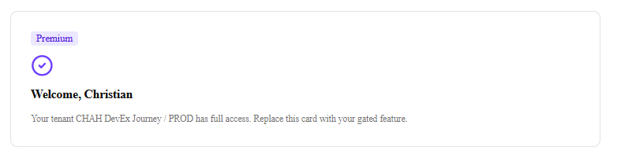
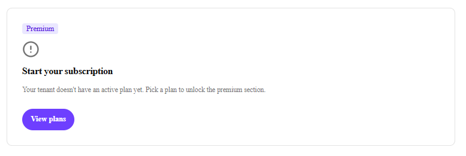
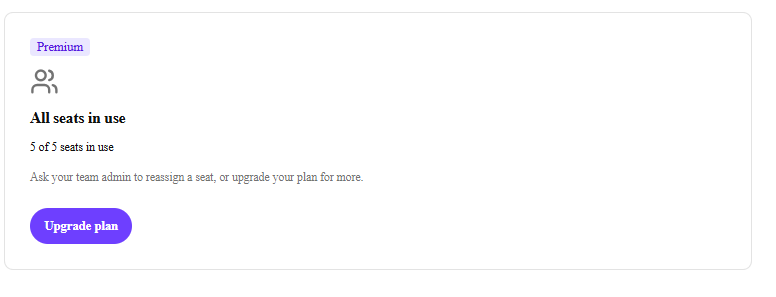
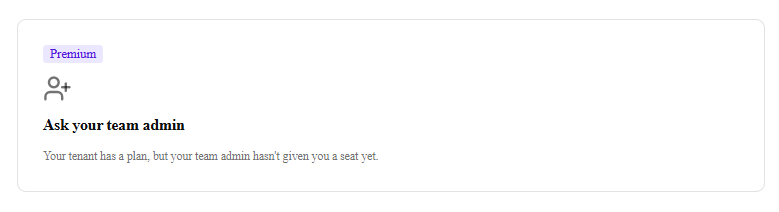

# Smoke Walkthrough — Paywall Blueprint PRD-000

Step-by-step walkthrough of the 5-state validation matrix used at each operator gate.
Each section names the CLI command to reproduce the state, the expected outcome, and a
screenshot reference.

> **Screenshot status:** POC clickdummy HTML references are used until the operator
> captures real Cloud Portal screenshots. Replace the image references below with
> `docs/screenshots/*.png` captures from the running app in the iframe.

---

## Setup

Before walking any state, complete the one-time setup:

1. **Install dependencies.**
   ```bash
   cd site && npm install
   ```

2. **Create Supabase project** at [supabase.com](https://supabase.com). Capture URL,
   publishable key, and secret key.

3. **Run the schema.**
   In Supabase SQL Editor: paste `site/supabase/schema.sql` and run.

4. **Configure environment.**
   ```bash
   cp site/.env.example site/.env.local
   # Fill in NEXT_PUBLIC_SUPABASE_URL, NEXT_PUBLIC_SUPABASE_PUBLISHABLE_KEY,
   # SUPABASE_SECRET_KEY, OPERATOR_TENANT_ID, OPERATOR_USER_ID
   ```

5. **Register custom app** in Cloud Portal → App Studio:
   - App URL: `http://localhost:3000`
   - Extension point: `xmc:fullscreen`
   - Route URL: `/`

6. **Start the dev server.**
   ```bash
   npm run dev
   ```

---

## Tranche A — Iframe install (operator gate T012)

**Command:** none (visual inspection after dev server starts)

**Steps:**
1. Install the custom app on your test tenant in Cloud Portal.
2. Navigate to the SitecoreAI Full Screen section where your app is installed.
3. Confirm the app renders in the iframe.

**Expected outcome:**
- Blok topbar visible at the top with label "Paywall Blueprint".
- Free section ("Inventory at a glance") visible above the separator.
- Hardcoded "Welcome, there" gated section visible below.
- Both sections visible on one screen at ≥ 1024×768 without scrolling.
- Colors, spacing, typography match Blok design tokens.

**Screenshot reference:**



---

## Tranche B — Real-identity welcome (operator gate T026)

**Command:**
```bash
npm run seed:state -- allowed --tenant <your-marketplaceAppTenantId>
```

**Steps:**
1. Run the seed command above.
2. Refresh the app in the Cloud Portal iframe.

**Expected outcome:**
- Gated section shows "Welcome, [your first name]" using the real name from
  `application.context.user.name`.
- Body: "Your tenant [your tenant name] has full access."
- If `user.name` is unavailable, falls back to email local part; then "there".
- If `tenant.name` is unavailable, falls back to last 8 chars of `tenant.id`.

**Screenshot reference:**


---

## Tranche C — Four-state walkthrough (CHALLENGE GATE, operator gate T039)

### State 1: Allowed

**Command:**
```bash
npm run seed:state -- allowed --tenant <your-marketplaceAppTenantId>
```

**Expected outcome:** Post-gate welcome with real identity. CircleCheck icon visible.

**Screenshot reference:**


---

### State 2: No subscription

**Command:**
```bash
npm run seed:state -- no-sub --tenant <your-marketplaceAppTenantId>
```

**Expected outcome:**
- Headline: "Start your subscription"
- Body: "Your tenant doesn't have an active plan yet. Pick a plan to unlock the premium section."
- CTA: "View plans" button opening `https://example.com/buy` in a new tab.
- Free section above the separator still visible.

**Screenshot reference:**



---

### State 3: All seats in use (design-reference — evaluator bypassed)

**Command:**
```bash
npm run seed:state -- seats-full
```

This opens `http://localhost:3000/?previewState=seats-full` in your browser. The
entitlement evaluator is NOT called — the state component is rendered directly per
ADR-0011 (PRD-000 evaluator never returns this variant; PRD-002 wires the routing).

**Expected outcome:**
- Headline: "All seats in use"
- Sub-line: "5 of 5 seats in use" (uses the default `seatsTotal={5}` passed by the CLI)
- Body: "Ask your team admin to reassign a seat, or upgrade your plan for more."
- CTA: "Upgrade plan" opening `https://example.com/upgrade` in a new tab.

**Screenshot reference:**



---

### State 4: User unassigned (design-reference — evaluator bypassed)

**Command:**
```bash
npm run seed:state -- unassigned
```

Opens `http://localhost:3000/?previewState=unassigned`. Evaluator bypassed per ADR-0011.

**Expected outcome:**
- Headline: "Ask your team admin"
- Body: "Your tenant has a plan, but your team admin hasn't given you a seat yet."
- No CTA button or link (deliberate per PRD-000 design spec).

**Screenshot reference:**



---

### State 5: Error fallback (error boundary smoke)

**Steps:**
1. Temporarily break the Supabase URL in `.env.local`
   (e.g. set `NEXT_PUBLIC_SUPABASE_URL=https://invalid.example.com`).
2. Restart the dev server: `npm run dev`.
3. Refresh the app in the iframe (with a valid seeded state in place — the error
   occurs when the store call rejects).

**Expected outcome:**
- Gated section shows error fallback: "Something went wrong" / "Please refresh the
  page or try again in a moment."
- **Free section above the separator is still visible and unaffected.** (NFR-6)
- Browser console shows a `[PaywallBlueprint]` error log.

**Screenshot reference:**

> Screenshot omitted (operator chose not to capture error/banner states).
> Error fallback structure preserved as a code reference in `src/components/error-boundary.tsx`.

**Cleanup:** Restore the real Supabase URL and restart the dev server.

---

## Tranche D — Env-flag toggle + dev override (operator gate T046)

### Env-flag disabled

**Steps:**
1. Set `NEXT_PUBLIC_PAYWALL_ENABLED=false` in `.env.local`.
2. Restart dev server.
3. Refresh the iframe (regardless of what entitlement state is seeded).

**Expected outcome:**
- "Paywall disabled — demo mode" banner visible immediately below the topbar, full width.
- Gated section renders premium content verbatim (no entitlement call made).
- No store interaction (Supabase not called).

**Screenshot reference:**

> Screenshot omitted (operator chose not to capture error/banner states).
> Banner copy locked verbatim in `src/lib/paywall/DemoModeBanner.tsx`.

**Cleanup:** Set `NEXT_PUBLIC_PAYWALL_ENABLED=true` and restart.

---

### Dev override

**Steps:**
1. Seed the no-subscription state so the evaluator would normally deny access:
   ```bash
   npm run seed:state -- no-sub --tenant <your-marketplaceAppTenantId>
   ```
2. Set `NEXT_PUBLIC_PAYWALL_DEV_OVERRIDE_USER_ID=<your-host-user-sub>` in `.env.local`.
3. Restart dev server.
4. Refresh the iframe.

**Expected outcome:**
- Gate short-circuits to `allowed` and shows `<AllowedState />` — no entitlement store
  call made, even though `no-sub` is seeded.
- `onStateChange('dev-override')` fires (visible in DevTools React DevTools if wired).

**Cleanup:**
1. Unset or comment out `NEXT_PUBLIC_PAYWALL_DEV_OVERRIDE_USER_ID`.
2. Restart dev server.
3. Refresh — gate should now evaluate normally and show `<NoSubscriptionState />`.

---

### DCE verification

**Command:**
```bash
npm run build
npm run test:dce
```

**Expected outcome:**
- `npm run build` exits 0.
- `npm run test:dce` (post-build grep of `.next/` for `NEXT_PUBLIC_PAYWALL_DEV_OVERRIDE_USER_ID`)
  returns zero matches, confirming the entire dev-override branch is dead-code-eliminated
  from the production bundle (NFR-5).

See `project-planning/gate-evidence/tranche-d-dce-grep.txt` for the verified outcome.

---

## Tranche E — Ship validation (operator gate T054)

**Verify all OSS artifacts are present:**

```bash
ls products/paywall-blueprint/README.md
ls products/paywall-blueprint/CHANGELOG.md
ls products/paywall-blueprint/LICENSE
ls products/paywall-blueprint/CONTRIBUTING.md
ls products/paywall-blueprint/SECURITY.md
ls products/paywall-blueprint/docs/smoke-walkthrough.md
ls products/paywall-blueprint/docs/cold-read-notes.md
ls products/paywall-blueprint/site/supabase/schema.sql
ls products/paywall-blueprint/site/.env.example
```

**Final build regression:**

```bash
cd site
npx tsc --noEmit   # TypeScript type-check — exit 0
npm run lint       # ESLint — exit 0 (≤7 pre-existing warnings tolerated)
npm run build      # Next.js production build — exit 0
npm run test       # Vitest — all 74 tests pass
npm run test:dce   # DCE grep — zero matches in .next/
```

All five must exit 0.

---

## Five operator gate evidences

The following gates were recorded in the run manifest (`project-planning/workflow/run-20260513T093404Z.json`):

| Gate | Task | Status |
|------|------|--------|
| Tranche A — iframe install | T012 | passed |
| Tranche B — real-identity welcome | T026 | passed |
| Tranche C — 4-state challenge gate | T039 | passed |
| Tranche D — env-flag + dev override | T046 | passed |
| Tranche E — cold-reader (G3) | T050 | pending (operator action) |

G3 cold-reader outcome is recorded in `docs/cold-read-notes.md`.
