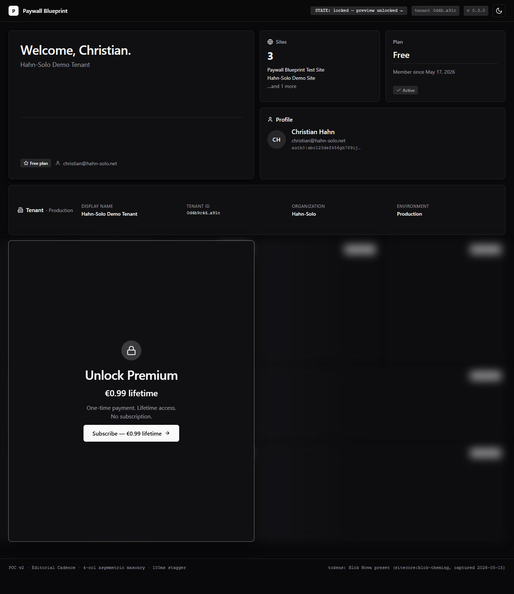
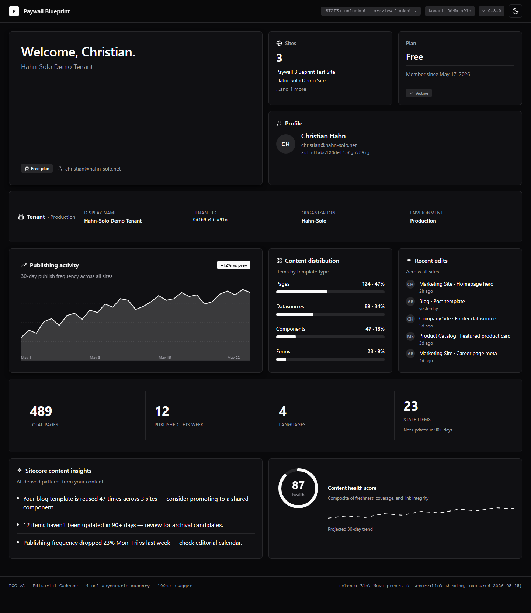

# Paywall Blueprint — site/

This is the Next.js application for the Paywall Blueprint Sitecore Marketplace App.

For the full OSS-facing README including quickstart, adoption guide, and swap-points, see `products/paywall-blueprint/README.md` (written at Tranche E).

## Screenshots

The bento dashboard at `/full-page` in a real Sitecore Cloud Portal tenant (dark theme).

### Locked — free tier visible, premium blurred


*5 free cards (Welcome, Sites, Plan, User profile, Tenant info) render real tenant data. The 6 premium cards mount as placeholder silhouettes under `filter: blur(12px)` per ADR-0018. The Subscribe banner sits as a sibling of the blurred region (POC v2 § 7) so it stays readable above the rasterized children.*

### Unlocked — full premium tier revealed after €0.99 lifetime payment


*All 11 cards visible after Stripe Checkout success → iframe reload → entitlement evaluates to `allowed`. Premium cards stagger-in over 600ms with 100ms per-card delays following DOM = visual reading order (P1 → P6). The Recharts area chart, P2 progress bars, P4 KPI counters, and P6 progress ring all animate on mount.*

### Stripe Checkout — €0.99 lifetime


*Stripe-hosted checkout opens in a new tab after the user clicks Subscribe in the bento's Unlock banner. Line item: "Paywall Blueprint Premium — Lifetime access to premium content for your tenant. One-time payment, unlimited seats." On successful payment Stripe redirects to `/paywall-return`; the iframe's `useEntitlement` hook detects the entitlement flip via `visibilitychange` + 3 s polling and triggers `window.location.reload()` → the bento re-renders unlocked.*

## Local development

This is a **Mode A 4a client-side scaffold** — HTTP on localhost is fully supported. No HTTPS dev server, no mkcert, and no certificate trust dance are required.

The Chrome Local Network Access (PNA) headers added to `next.config.mjs` in T004 are the correct mechanism for allowing the Cloud Portal's iframe (served from a public origin) to load the app at `http://localhost:3000`. See `next.config.mjs` for the exact header block.

To start the dev server:

```bash
cd site
npm install
npm run dev
```

The server starts at `http://localhost:3000`. Register a custom app in Cloud Portal → App Studio pointing to `http://localhost:3000` (see T007 operator instructions for exact values).

**Why no mkcert?** Mode A client-side apps communicate via the portal's postMessage bridge, not via cookies set at the app origin. Only the full-stack scaffold (Mode B) — which uses Auth0 PKCE cookies that require `SameSite=None; Secure` — needs HTTPS + mkcert. This app is Mode A only (per ADR-0005). This supersedes the architect-stage assumption recorded in the run manifest's `operator_attention` (resolved 2026-05-13 per `sitecore:marketplace-sdk-testing-debug` § 3).

## Scripts

```bash
npm run dev          # Start dev server at http://localhost:3000
npm run build        # Production build
npm run start        # Start production server
npm run lint         # ESLint
npm run typecheck    # TypeScript type-check (tsc --noEmit)
npm run test         # Run Vitest test suite (once)
npm run test:watch   # Run Vitest in watch mode
```

## Adding Blok components

The `@blok` registry is registered in `components.json`. To add more Blok components:

```bash
npx shadcn@latest add @blok/<component-name>
```

Example:

```bash
npx shadcn@latest add @blok/button @blok/card @blok/dialog
```

## Using components

```tsx
import { Button } from "@/components/ui/button";
```

## Scaffold

This app was scaffolded via the canonical Blok Marketplace client-side quickstart:

```bash
yes '' | npx --yes shadcn@latest add https://blok.sitecore.com/r/marketplace/next/quickstart-with-client-side-xmc.json --yes --cwd site
```

The scaffolded `site/next-app/` subdirectory was flattened to `site/` immediately after scaffolding (per `sitecore:setup-marketplace-client-side` flatten step).

## Customizing the bento

### The pattern

`<BentoGrid>` in `site/components/bento/bento-grid.tsx` is the single fetch-orchestration point. It receives `tenantsRow` from the server-rendered RSC (`app/full-page/page.tsx`) and passes typed props down to each card. No fetches occur inside card bodies (NFR-10 — enforced by `test:no-fetch-in-premium`).

The 11 cards live in `site/components/bento/`:

| Slot | Component | Type | Data source |
|------|-----------|------|-------------|
| F1 | `<WelcomeHero>` | free | `useHostUser()` + `useAppContext()` |
| F2 | `<SitesTile>` | free | `client.query('xmc.sites.listSites', …)` |
| F3 | `<PlanCard>` | free | `tenantsRow` prop (Supabase) |
| F4 | `<UserProfile>` | free | `useHostUser()` |
| F5 | `<TenantInfo>` | free | `useAppContext()` |
| P1–P6 | `<ActivityChart>` … `<ContentHealthScore>` | premium | Hardcoded fake data (ADR-0018) |

### Swap a free card

To replace `<UserProfile>` with a custom card:

```tsx
// 1. Create your card in site/components/bento/my-card.tsx
interface MyCardProps {
  hostUser: ReturnType<typeof useHostUser>;   // or whatever data you need
  "data-card"?: string;
}
export function MyCard({ hostUser, "data-card": dataCard }: MyCardProps) {
  return (
    <Card style="outline" elevation="sm" padding="sm" data-card={dataCard}>
      <p>{hostUser?.given_name}</p>
    </Card>
  );
}

// 2. In bento-grid.tsx, replace <UserProfile … /> with:
const hostUser = useHostUser();
// …
<MyCard hostUser={hostUser} data-card="f4" />
```

If the card needs data from the hosting tenant context, use `useHostUser()` (identity) or `useAppContext()` (resource access). If it needs Supabase row data, pass an additional prop from the `tenantsRow` argument BentoGrid already receives. Do not add a new fetch inside the card body.

### Swap a premium card with real data

When you have a real entitlement check in place (see "Production hardening" below), you can replace the fake premium data with a real SDK call. The fetch **must happen server-side** (R5b — adopter hardening):

```tsx
// app/full-page/page.tsx (Server Component)
import { createMarketplaceXmcClient } from "@sitecore-marketplace-sdk/xmc";

// Guard server-side before fetching
const entitlementCheck = await checkEntitlement(marketplaceAppTenantId);
const analyticsData = entitlementCheck.status === "allowed"
  ? await createMarketplaceXmcClient(…).query("xmc.analytics.getSummary", …)
  : null;

// Pass as prop to BentoGrid
<BentoGrid tenantsRow={tenantsRow} analyticsData={analyticsData} />
```

See `sitecore:marketplace-sdk-xmc` for the full SDK query/envelope shape. The double-unwrap pattern (`result.data?.data`) confirmed at Gate B real-tenant smoke applies to `xmc.sites.listSites` and may apply to other `xmc.*` queries.

### The locked-state DOM structure (CRITICAL)

`<SubscribeBanner>` **MUST stay a sibling of `.premium-region`**, never a child:

```tsx
// CORRECT (POC v2 § 7 canonical structure)
<div className="premium-section">
  <div className="premium-region premium-region--locked">
    {/* P1–P6 cards */}
  </div>
  <SubscribeBanner />   {/* SIBLING — not inside premium-region */}
</div>

// WRONG — causes blur rasterization
<div className="premium-region premium-region--locked">
  {/* P1–P6 cards */}
  <SubscribeBanner />   {/* CHILD — filter: blur(12px) rasterizes the banner */}
</div>
```

If a fork moves the banner inside `.premium-region`, the `filter: blur(12px)` applied to that element will rasterize the banner text, making it unreadable. The structural regression test in `bento-grid.test.tsx` (`banner.closest('.premium-region') is null`) guards this invariant.

### Card visual conventions

All bento cards use:

- **Container:** `<Card style="outline" elevation="sm" padding="sm">` — gives the bento aesthetic (no fill, visible border, compact padding)
- **Colors:** semantic Blok tokens only (`text-foreground`, `text-primary`, `text-muted-foreground`, `bg-muted`, etc.) — the `test:no-hex-in-bento` script enforces no hex literals in `components/bento/**` and `components/theme-toggle.tsx`
- **Accent values:** KPI numbers, percentages, chart ring values — use `text-primary` for visual lift
- **Chart fills:** use `var(--primary)` directly (not `hsl(var(--primary))` — the HSL wrapper is broken syntax for Recharts color props; the Nova preset `--primary` is already a hex value)

## Production hardening for adopters

This blueprint ships with a **showcase posture** — certain dev affordances are always visible and premium data is fake. Before shipping to production, adopters must address the following.

### 1. ThemeToggle visibility (ADR-0016)

The blueprint always renders the `<ThemeToggle>` in the topbar to demonstrate the three-state theme system. In production, gate it behind an environment variable:

```tsx
// app/full-page/page.tsx — rightSideItems array
const rightSideItems: RightSideItem[] = [
  ...(process.env.NEXT_PUBLIC_SHOW_THEME_TOGGLE === "true"
    ? [{ id: "theme", node: <ThemeToggle /> }]
    : []),
  { id: "tenant-id",       node: <TenantIdBadge /> },
  { id: "paywall-version", node: <PaywallVersionOverride /> },
];
```

Set `NEXT_PUBLIC_SHOW_THEME_TOGGLE=true` in your deploy environment when you want the toggle visible to end users (e.g., during a design-polish phase). Omit the variable (or set it to anything other than `"true"`) to hide the toggle in production.

### 2. Premium DOM exposure (ADR-0018 + R5b)

**This is the most important hardening step.** In the blueprint, premium cards (P1–P6) render hardcoded fake data inside the DOM — they are visually blurred, but the markup is present in the HTML source. This is intentional for a showcase, but **unacceptable when you replace fakes with real premium data**.

When adopters replace fake premium content with real tenant data, they MUST gate the fetches server-side:

1. **Check entitlement server-side** before fetching any premium data:
   ```tsx
   // app/full-page/page.tsx (Server Component)
   const entitlement = await fetchEntitlementServerSide(marketplaceAppTenantId);
   const premiumData = entitlement?.status === "allowed"
     ? await fetchPremiumData(marketplaceAppTenantId)
     : null;
   ```

2. **Return empty/null props from the RSC** if entitlement is not `allowed` — the premium cards receive `null` and render their placeholder silhouettes. Real data never enters the HTML.

3. **Do not use `useEntitlement()` alone as the gate** — the hook drives UI state (locked/unlocked CSS classes) but does not prevent server-rendered markup from containing premium data. The server-side check is the authoritative gate.

A `withEntitlement(handler)` HOF to wrap route handlers is a candidate for a future PRD.

### 3. Production hardening checklist

Operators forking this blueprint for production use can self-audit with this checklist:

1. [ ] `NEXT_PUBLIC_SHOW_THEME_TOGGLE` set to `"true"` only in environments where the toggle is intentionally visible; absent or `"false"` in all others.
2. [ ] All premium data fetches are gated by a server-side entitlement check (not just `useEntitlement()` on the client) before the RSC fetches or passes data to premium card props.
3. [ ] `npm run test:no-fetch-in-premium` still exits 0 after any changes to premium card components (confirms no fetch leaked into card bodies).
